# 领域驱动设计

分段式协作分为三个阶段：战略设计、战术设计、战术实现

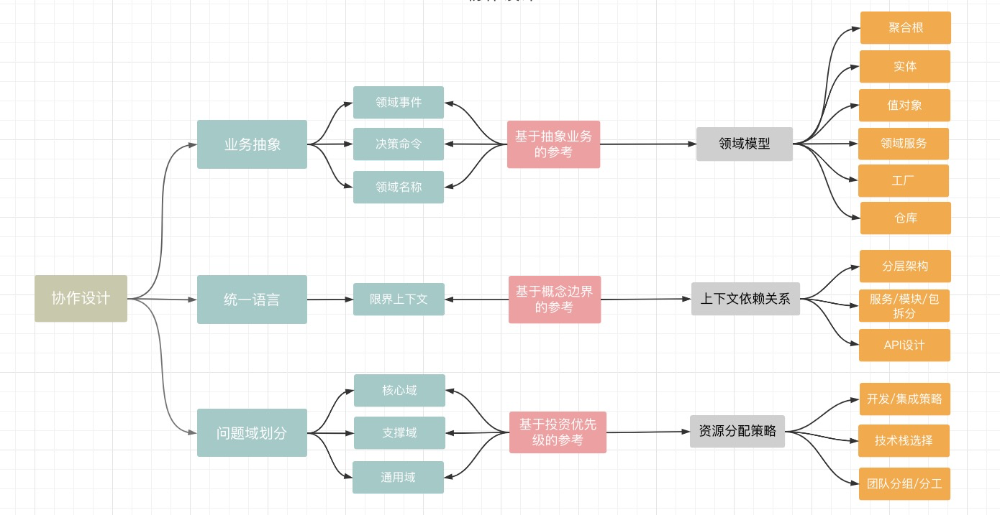


## 战略设计

在整个设计过程中，<font color="red">务必忽略具体的技术实现细节，做到抽象与实现细节解耦</font>，从而满足”领域驱动“而不是”技术实现驱动“。

- 业务梳理和抽象

  - 识别**领域事件**：领域事件，在业务上真实发生的事，会对系统产生重要影响，因为过去所有发生的对业务有意义的信息都会以某种形式保存下来。事件以”XXX以YYY“的形式进行命名。

    **规则**：是对分支条件或复杂业务规则的抽象，目的是通过降低分支复杂度聚焦主要业务流程。以”XX规则“的名词进行命名。（使用场景：a. 开启了一条分支事件流；b. 简化复杂但对主流程影响不大的规则判断）

    <font color="red">领域事件具有原子性，必须拆分到不可拆分为止</font>

    影响：对内产生改变某种数据，触发某种流程；对外发送了某些消息

  - 识别**决策命令**：是领域事件的触发动作，代表业务流程上的重要业务决策。技术实现上会通过领域类的方法来实现。

    **实施者**：是触发决策命令的原因（可以是：具体用户角色、外部系统、定时任务、前一个事件）

  - 识别**领域名词**：是在业务上下文中存在的领域概念，通常是：决策命令与领域事件中均出现的名词。
  
    快速识别或抽象，在每一对决策命令和领域事件之间最相关的业务概念，以名词产出。此间通过重命名方式消除二义性，减少理解上的混乱

|                                              |                                              |
| -------------------------------------------- | -------------------------------------------- |
| 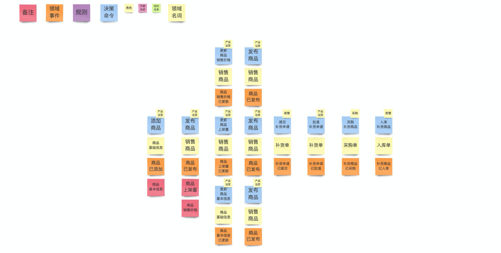 | 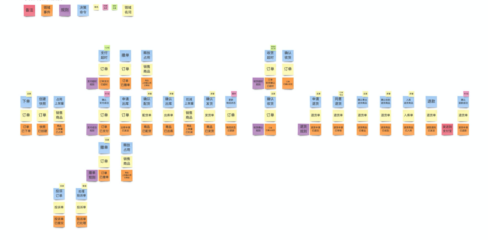 |

- 限界上下文、弹性边界识别

  - 限界上下文，是业务上下文的边界，在该边界内，交流某个概念，不会产生理解和认知的二义性，限界上下文是统一语言的重要保证。

    <font color="red">限界上下文具备概念上的独立性，一个限界上下文内的子概念解释都不应该超出上下文的边界</font>

    将业务场景中识别出的全部领域名词和外部系统提取出，保证不重复。根据业务相关性，对领域名词进行归类，每个外部系统单独放置，然后用实线圈出每一组领域名词，每一个圈按照“XX上下文”方式进行抽象命名。

    进行分类时，需要从以下维度进行考虑：

    1. 语言二义性
    2. 变化一致性
    3. 业务相关性
    4. 概念相关性

  - 弹性边界，直接决定是否需要将系统拆分成多个能够独立开发、部署和运行的服务，而业务则影响系统内的业务组件划分

    在弹性边界内的应用，具备同样的伸缩原因和一致性边界：

    - 可以是功能性需求决定的，如客户对功能模块的自由性选择需求，提供不同组件
    - 也可以是非功能性需求，如按照伸缩性和容错性需求，停止服务就一同停止服务，还是只停止其中一个服务，其他服务不受影响

  - 便于操作理解，约定：

    - 一个弹性边界内可以包含多个限界上下文
    - 一个限界上下文不应跨越弹性边界

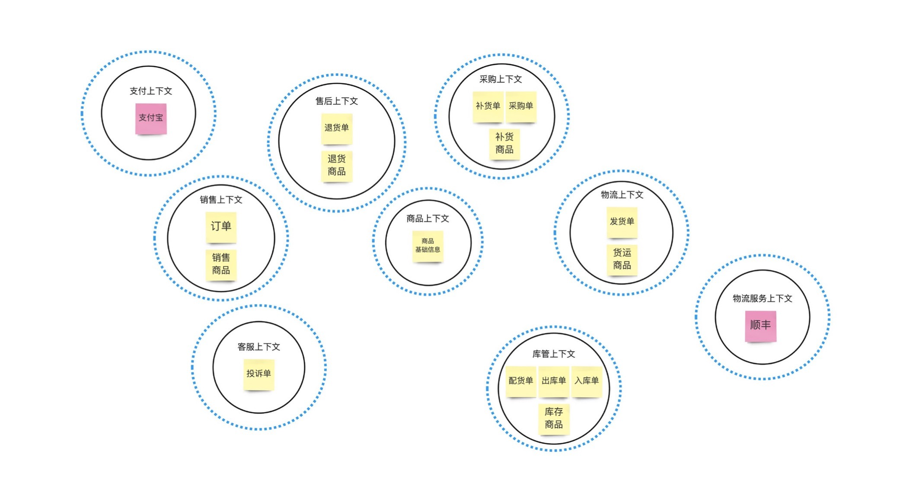

通过分析依赖关系，提前识别依赖矛盾，减少低级设计错误。若出现以下依赖关系，需要考虑是否存在未澄清问题：

1. 双向依赖：上下文间缺少一层未被澄清，或者二者可以合二为一
2. 传染依赖：任何一个上下文发生变更，依赖链条上的上下文均需要变化
3. 过长依赖：自身依赖信息不能直接从依赖者获得，需要链接过长，依赖链条上任何一个上下文发生变化，其后链条上的上下文均可能需要改变

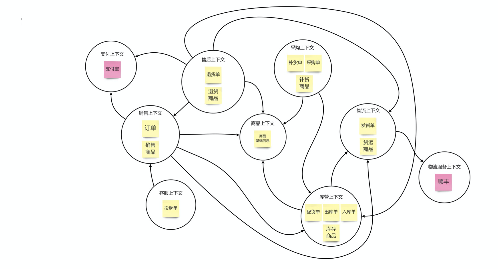

- 子域识别

  是对问题域的澄清和划分，同时也是对于资源投入优先级的重要参考。<font color="red">每一个问题子域负责解决一个有独立业务价值的业务问题</font>

  - 核心域：是整个业务的盈利来源和基石，如果核心域不存在，那么整个业务就不能运作
  - 支撑域：是支撑核心域运作的问题，具备强烈个性化需求
  - 通用域：该类问题业内常见，可能有现成方案，通过改造就可以使用

  可以先识别核心域，再识别通用域，最后剩下的都是支撑域。

  <font color="red">问题子域和限界上下文是完全不同的两个概念：问题子域解决的是问题澄清和优先级排序问题；限界上下文解决的是业务边界识别和统一语言问题。</font>

  便于操作理解，约定：

  - 一个子域可以包含多个限界上下文
  - 一个限界上下文不应跨越多个子域


## 战术设计

- 领域建模

  <font color="red">领域模型是抽象模型，与具体的实现细节无关，不要过早的考虑面向对象或者数据表设计。</font>

  - 典型的"自下(数据库)而上，而非自上(抽象)而下设计"：子实体携带有父实体的ID，这是一种数据库外键关联和查询需求而非抽象模型。

  领域模型(Domain Model )， 是对业务的高度抽象， 利用抽象模型作为业务子和系统实现的核心联系，领域模型封装和承载了全部的业务逻辑，并通过聚合的方式保持业务的"高内聚，低耦合"。

  1. 选择并聚焦一个限界上下文，将**领域名词**与其所相关的所有**决策命令**和**领域事件**放在一起。
  2. 基于聚合、聚合根、实体、值对象的定义和识别原则，将所有领域名词按照其所具备的业务概念联系起来，并识别为适合的类型。
  3. 用实线联系聚合内的实体，用虚线联系对另一个聚合的引用。
  4. 识别实体与实体、实体与值对象之间的数量对应关系，并按照图例所示的要求进行标识。
  5. 在分析的过程中不断的检验、发现和补充缺失的重要业务概念，消除二义性，统一语言，迭代式的完善模型。
  6. **将聚合相关的决策命令和领域事件放置到该聚合的聚合根上方**。
  7. 在建模完成后，可以利用未来可能性较高的相关业务变更需求来检验模型的合l理性(业务响应力)，看看是否只需要做少量修改即可匹配新的业务需求。

  聚合(Aggregate )， **聚合负责封装业务逻辑， 通过一致性边界和统一语言，内聚决策命令和领域事件**，容纳并识别领域名词为以下不同的抽象模型：

  - 聚合根(Aggregate Root) ：是一种实体， 是聚合的根节点。
    - 聚合根负责执行业务规则。
    - 聚合根有全局标识。边界内的实体只有局部标识，在聚合内唯一。
    - 聚合边界外的对象只能引用聚合根，不能持有聚合内对象的引用。
    - 边界内的对象可以持有对其他聚合根的引用。
    - 删除操作必须全部删除边界内的对象。
    - 聚合边界内任何对象发生改变，都不能违反聚合的整体业务规则。
    - 只有聚合根能直接从持久化系统查询得到，边界内对象只能从聚合根导航。
  - 实体(Entity ) ：是聚合的主干， 具有唯一标识和生命周期。
    - 具有生命周期
    - 有唯一标识
    - 通过Id判断相等性
    - 增删改查/持久化
    - 可变
    - 比如Order/Car
  - 值对象(Value Object ) ：是实体的附加业务概念， 用来描述实体所包包含的业务信息。
    - 起描述性作用
    - 无唯一标识
    - 通过属性判断相等性
    - 实现Equals) 方法
    - 即时创建/用完即扔
    - 不可变(Immutable)
    - 比如Address/Color

  聚合边界内具有强一致性，所以：

  - 一个聚合不应跨越弹性边界，否则难以解决事务一致性问题。
  - 一个聚合不应跨越限界上下文，否则会造成概念上的混淆，增加人员沟通和维护成本。

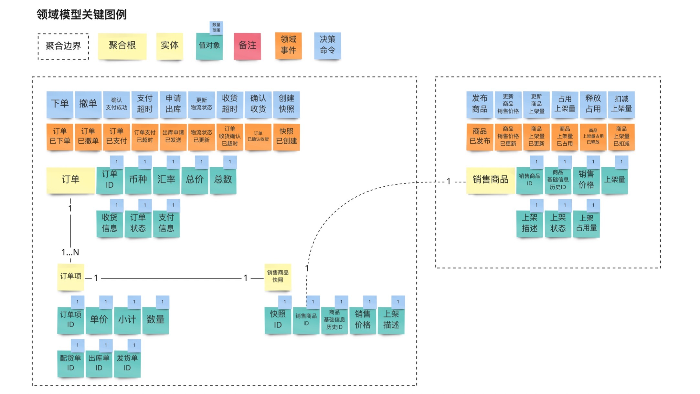

- 业务服务识别

  结合以下内容的分析结果，确定业务服务的划分(或合并)：

  1. 限界上下文分析结果(具有强二义性的两个上下文尽量不放在一个微服务中)；
  2. 弹性边界识别结果(决定性因素)；
  3. 问题子域划分结果(一个微服务尽量不跨越子域边界)；
  4. 领域模型的聚合设计结果(聚合绝不可拆分到不同微服务中)；

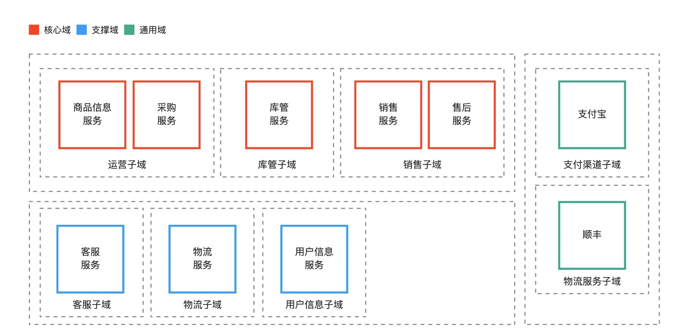

- 业务服务API能力识别
  1. 基于业务服务所包含的限界上下文，以及限界上下文内的聚合，**识别需要向外暴露的决策命令**，**决策命令的名称即可作为API的名称**。
  2. 补充缺失的其他具有业务价值的API。
  3. 按照"限界上下文、聚合、接口能力"的分类， 列出API清单。

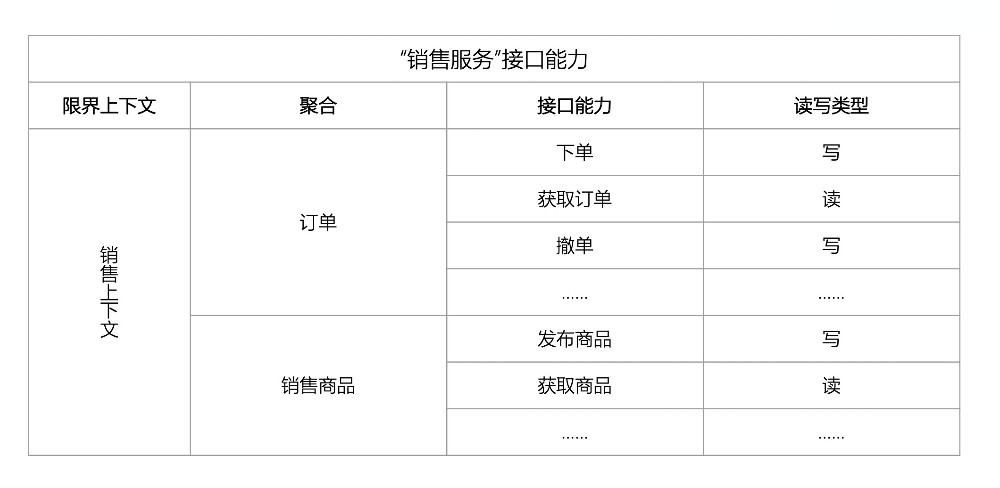


## 技术实现

技术实现环节涉及：UML设计、API详细设计、数据库设计、部署与运维...

对以下知识点一定要熟知：

- 聚合根
- 实体
- 值对象
- 领域服务
- 领域事件
- 资源库
- 限界上下文
- CQRS

### 分层架构

在落地领域驱动之前，首先明确的问题是选择何种架构去实现。

#### DIP改进分层

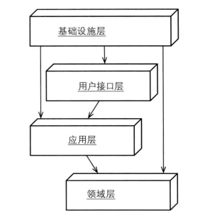

所谓的依赖倒置原则指的是：高层模块不应该依赖于低层模块，两者都应该依赖于抽象，抽象不应该依赖于细节，细节应该依赖于抽象。

正如架构图中看到的，**基础实施层位于其他所有层的上方，接口定义在其它层，基础实施实现这些接口**。或者可以这样来表述：领域层等其他层不应该依赖于基础实施层，两者都应该依赖于抽象。

这也就是意味着一个重要的落地指导原则： **<font color="red">所有依赖基础实施实现的功能，抽象和接口都应该定义在领域层或应用层中</font>**。

#### 六边形架构

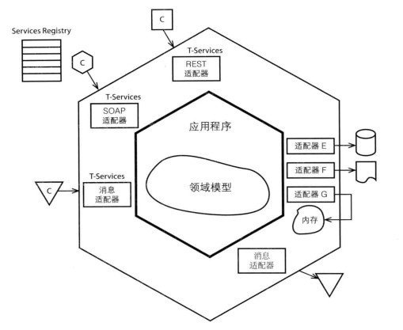

在这种架构风格中，外部客户和内部系统的交互都会通过端口和适配器完成转换，这些外部客户之间是平等的，比如用户web界面和数据库持久化，当需要一个新的外部客户时，只需要增加相应的适配器，比如当我们依赖外部一个RPC的服务时，只需要编写对应的适配器即可。

这种设计角度下，没有前端web和数据库后端之分，统一为外部客户。

如果外部客户时HTTP请求，那么SpringMVC的注解和Controller构成了适配器；如果外部客户时MQ消息，那么适配器就是MQConsumer监听器；如果外部客户时数据库，那么适配器可能就是Mybatis的Mapper。

#### 洋葱架构

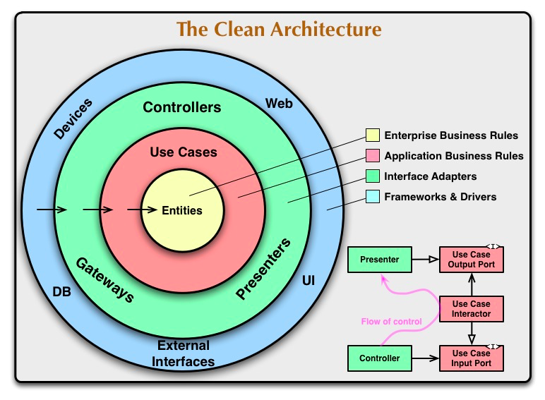

只允许外层依赖内层，不允许内层知道外层的细节。

### 驱动模式

在领域驱动架构中，通常会将查询和命令操作分开，我们称之为CQRS(命令查询的责任分离Command Query Responsibility Segregation)。

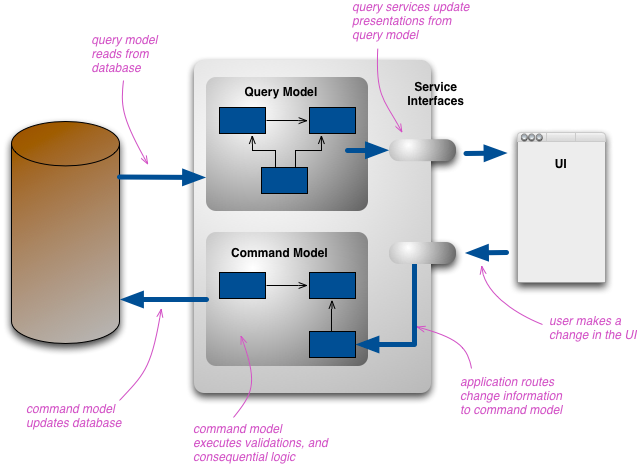

图中读模块Query Model和写模块Command Model只是逻辑分离，物理层面还是使用了同一个数据库，也可以将数据库改成读库和写库做到物理分离。

### 架构落地

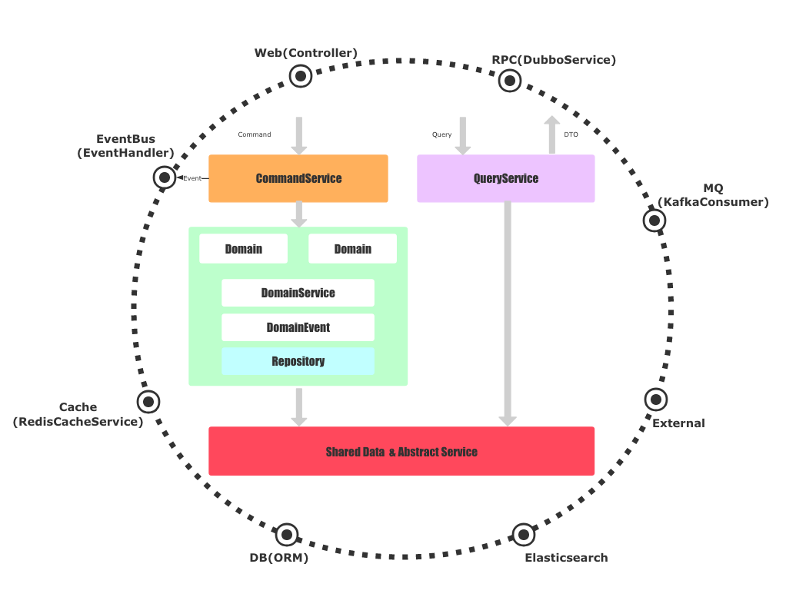

架构中，平等地看待Web、RPC、DB、MQ等外部服务，基础实施依赖圆圈内部的抽象。

当一个命令Command请求过来时，会通过应用层的CommandService去协调领域层工作，而一个查询Query请求过来时，则直接通过基础实施的实现与数据库或者外部服务交互。再次强调，**所有的抽象都定义在圆圈内部，实现都在基础设施**。

### 代码落地

#### 代码结构

```sql
java
└── com
    └── gtw
        └── business
            ├── application                -- 用户接口层
            │   ├── controller                -- HTTP 请求
            │   ├── mq                        -- mq 消费入口
            │   ├── report                    -- 报表类、查询入口
            │   ├── rpc                       -- rpc 服务提供入口（这里指rpc的实现，rpc接口提供单独放在可打包发布的module中）
            │   └── scheduler                 -- 定时任务调度入口
            ├── common                     -- 公共通用层
            │   ├── component                 -- 通用基础设施层的接口，如 mq，cache
            │   ├── model                     -- 公用的数据对象和抽象接口
            │   └── utils                     -- 工具类
            ├── domain                     -- 领域服务层
            │   ├── aggregate                 -- 领域模型
            │   └── service                   -- 领域服务
            ├── infrastructure             -- 基础设施层
            │   ├── cache
            │   ├── db                        -- 对领域服务中的仓储实现
            │   │   └── reponsitory           
            │   ├── event                     -- 对领域服务中的事件实现
            │   │   ├── listener
            │   │   └── publisher
            │   ├── mq                        -- mq 生产者
            │   └── rpc                       -- rpc 服务的调用
            └── service                    -- 应用服务层（CQRS）
                ├── command
                │   ├── cmd                -- 命令的请求参数XXXCommand对象
                │   └── impl               -- 命令请求服务的实现（请求接口直接定义在command包下）
                └── query
                    ├── dto                -- 查询结果DTO对象
                    ├── impl               -- 查询服务的实现（查询接口直接定义在command包下）
                    └── qry                -- 查询的条件参数XXXQry对象
```


#### 用户界面 `com.gtw.business.application.controller`

`Controller`作为六边形架构中与HTTP端口的适配器，起到了适配请求，委托应用服务处理的任务。对称性架构的好处就在于，当增加新的用户的界面时可以创建一个新包去承载适配器（比如为`mq`消费，在`application`目录下新增`mq`包），然后调用应用层的服务。

这里可以有个默认规范：**所有查询的条件封装成XXXQry对象，所有命令的请求封装成XXXCommand对象**。

考虑校验逻辑应该放到哪一层的时候确定这一层代码可以有请求参数的基本校验，但是**应用服务的校验逻辑是必须存在的，校验和应用服务的耦合是紧密的**。

#### 应用服务 `com.gtw.business.service`

应用服务的每个方法与用例是一一对应的，典型的处理流程是：

1. 校验
2. 协调领域模型或者领域服务
3. 持久化（事务控制）
4. 发布领域事件

发布领域事件的动作放在了应用层没有放在领域层，而领域事件的定义是在领域层，这是为什么呢？如果**不考虑持久化，发布领域事件的确应该在领域模型中，但是在代码落地时，考虑到持久化完成后才代表有了真实的事件，所以将触发事件的代码放到了资源库后面**。

#### 领域模型 `com.gtw.business.domain.aggregate`

采用了`aggregate`而不是`model`，是为了将聚合根的概念显现出来，每个聚合根单独成一个子包，在单个聚合根中包含所需要的值对象、领域事件的定义、资源库的抽象接口等。

**领域事件的定义、资源库的抽象接口**之所以放在相应聚合根的package中，是因为它更能体现这个领域模型，而且资源库的抽象和聚合根有着对应的关系（不大于聚合根的数量）。

关于聚合根对象的创建，特别提醒的是**聚合根对象的创建不应该被Spring容器管理**，也不应该在聚合根中注入其它对象。聚合根对象可以通过静态工厂方法来创建，下文还会介绍如何落地资源库进行聚合根的创建。

#### 领域服务 `com.gtw.business.domain.service`

业务逻辑什么时候该放在领域模型中，什么时候放在领域服务中，可以从以下几点考虑：

1. 不是属于单个聚合根的业务或者需要多个聚合根配合的业务，放在领域服务中（注意：是业务，如果没有业务，**协调工作应该放到应用服务中**）
2. 静态方法放在领域服务中
3. 需要通过rpc等其它外部服务处理业务的，放在领域服务中

#### 基础设施 `com.gtw.business.infrastructure`

基础设施可以对抽象的接口进行实现，资源库Repository的接口定义在领域层，那么在基础设施中就可以具体实现这个接口。

资源库Repository的实现就是将聚合根对象持久化，往往聚合根的定义和数据库中定义的结构并不一致，数据库的对象称为数据对象DO。

当持久化时就需要将聚合根序列化成数据库数据对象，通过资源库获取(构造)聚合根时，也需要反序列化数据库数据对象。可以基于反射或其它技术手段完成序列化和反序列化操作，这样可以避免聚合根中编写过多的getter和setter方法。

#### 查询服务 `com.gtw.business.service.query`

应用服务包含了commond和query两个子包，查询服务是在query包中。

运用CQRS设计，查询服务不会调用应用服务，也不会调用领域模型和资源库Repository，它会直接查询数据库或者ES获取原始数据对象DO，然后组装成数据传输对象DTO给用户界面，这个组装的过程称为Assembler，由于与用户界面有一定的对应关系，所以Assembler放在查询服务中。

是否需要将每个对象都转化成DTO返回给用户界面这个要看情况，个人认为当DO能满足界面需求时是可以直接返回DO数据的。

#### 落地MQ、Event、Cache

毫无疑问，MQ、Event、Cache的实现都应该在基础设施层，它们接口的定义放在哪里呢？一个方案是哪一层使用了抽象就在那一层定义接口，另一个方案是放到一个共有的抽象包下，基础设施和对应层依赖这个共有的抽象包。

#### RPC和防腐层

前面提到过，当我们暴露一个RPC服务时和web层是平等对待的，比如暴露一个dubbo协议的服务就和暴露一个http的服务是平等的。这一小节我们将来探讨如何与第三方系统的RPC服务进行交互。

这里涉及到DDD中Bounded Context和Context Map的概念，在领域驱动设计中，限界上下文之间是不能直接交互的，它们需要通过Context Map进行交互，在微服务足够细致的年代，我们可以做到一个微服务就代表着一个限界上下文。

通用做法会再创建一个Translator实现上下文模型之间的翻译功能。其它限界上下文的模型在我们系统中并不是一个模型实体，而是一个值对象，很显然Adapter应该放在基础设施层中，那么这个值对象存放在哪里呢？我们可以将值对象和抽象接口定义在领域层，然后基础设施通过适配器和翻译器实现抽象接口，很明显这个做法是非常可取的。在具体落地时我们发现，这些值对象可能同时又被查询服务依赖，所以值对象和抽象接口定义在shared Data & Service中也是可取的，具体放在那里因看法而异。

### Example

需求-节选自《领域驱动设计第7章》：假设正在为一家货运公司开发新的软件，最初的需求包括三项基本功能：

1. 事先预约货物
2. 跟踪客户货物的主要处理流程
3. 当货物到达其处理过程中的某个位置时，自动向客户寄送发票

演示如何落地：

1. 修改`/business-demo/src/main/resources/application.properties`数据库连接
2. 初始化数据库脚本文件`/business-demo/resources/mysql_init.sql`
3. 运行`Application.java`
4. 浏览器访问`http://localhost:8080/index.html`


